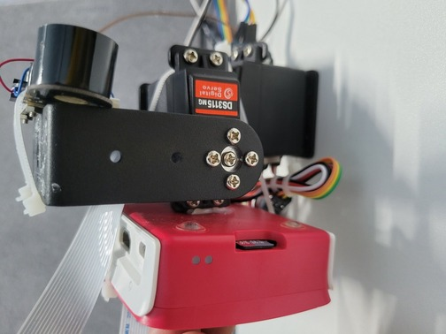

# cam_device

Hardware diagram and code of cam_device.

<br>
<br>

## Contents

- [Hardware diagram](#hardware-diagram)
- [Background](#background)
- [Install](#install)
- [Usage](#usage)
- [API](#api)

<br>
<br>

## Hardware diagram

### Raw material and assembly drawing





<br>
<br>

## Background

### The device can observe the state of the cat at home from multiple angles with the help of a double axle steering gear.

<br>
<br>

## Install

### run venv

```
cd /your/code/path
```

```
python3 -m venv /your/code/path
```

```
. /your/venv/path/bin/activate
```

### install flask
```
pip install Flask
```

<br>
<br>

## Usage

### run code
```
bash start_up_cam.sh
```

<br>
<br>

## API

### Adding...
