# Client_web

[](../../LICENSE)


<br>

Client_web for Pet_System.

<br>

## Contents
- [effect](#effect)
- [Install](#install)
- [Usage](#usage)
- [API](#api)

<br>
<br>

## effect

### **desktop**

<br>

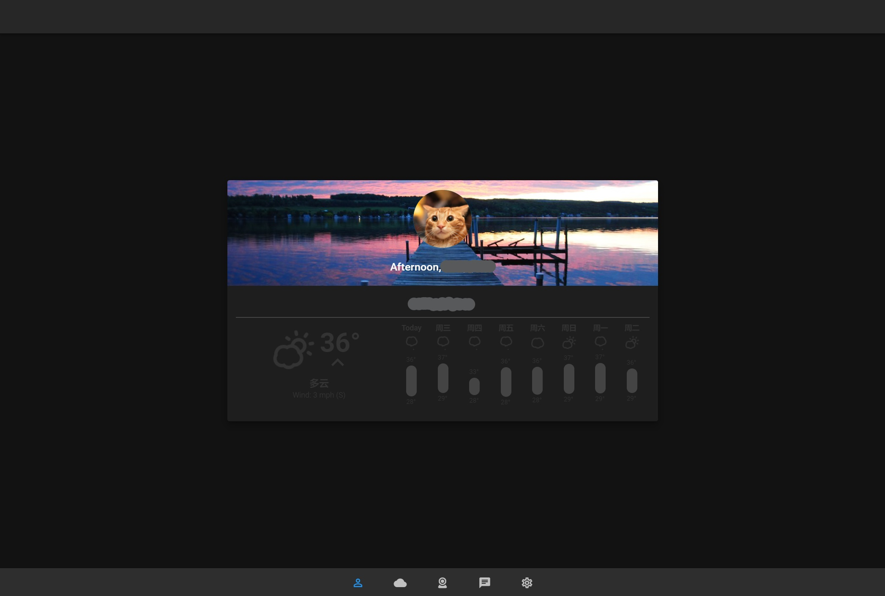

<br>

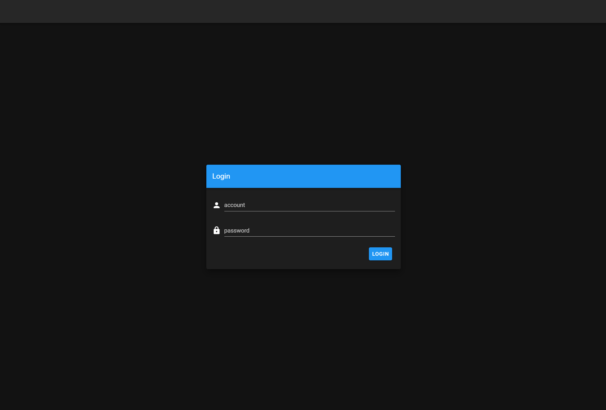

<br>

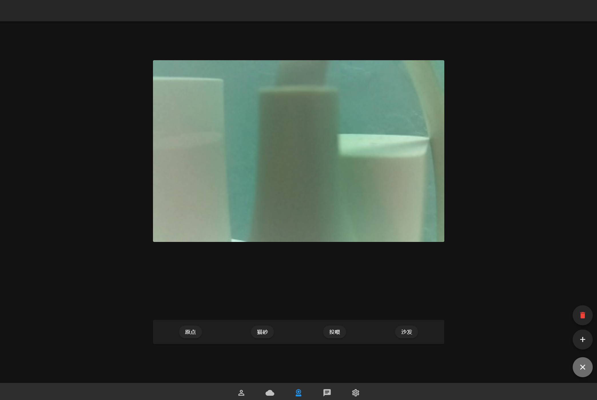

<br>

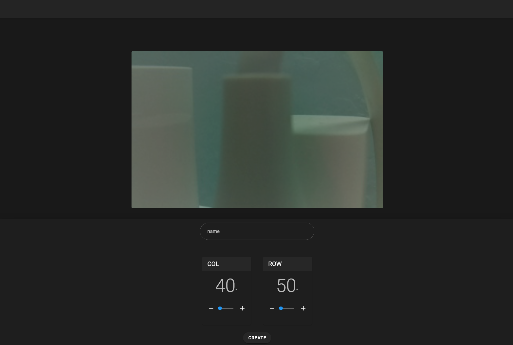

<br>

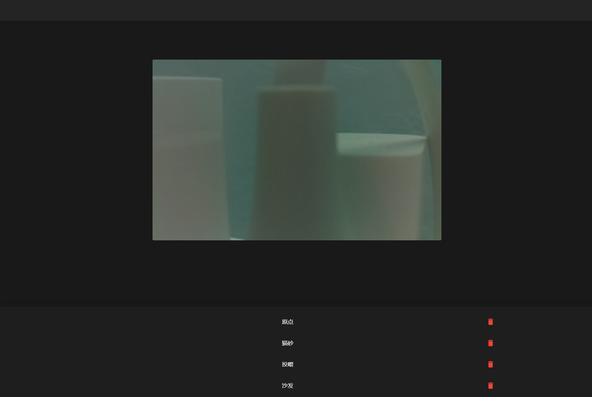

<br>

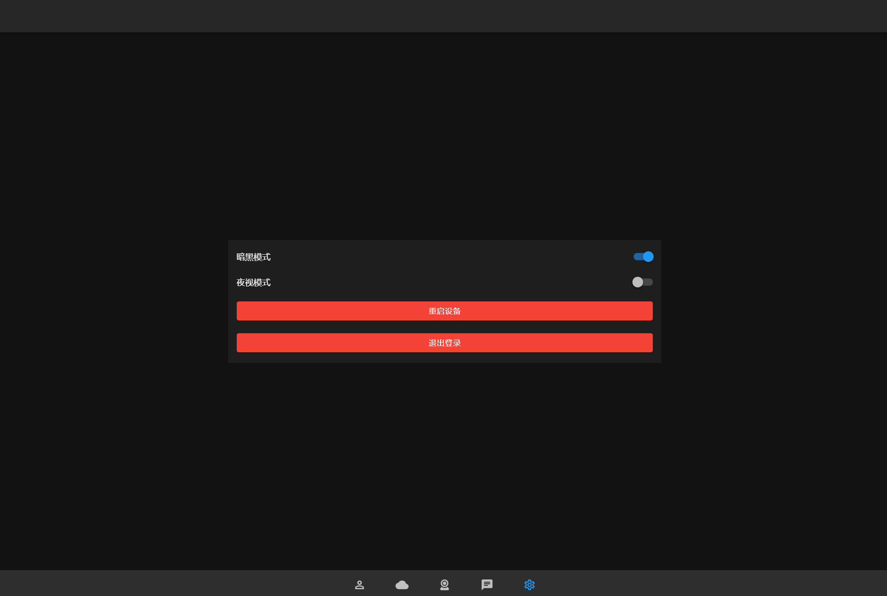

<br>

### **mobile**

<br>

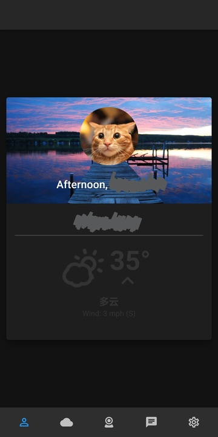
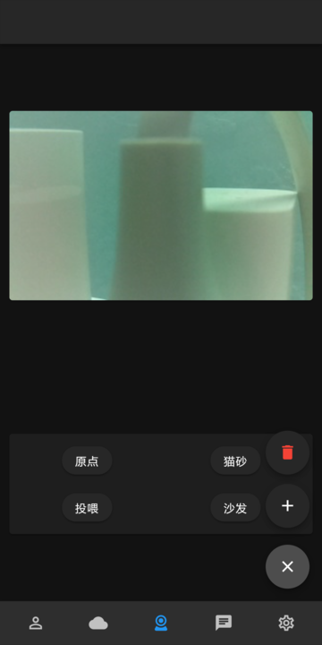
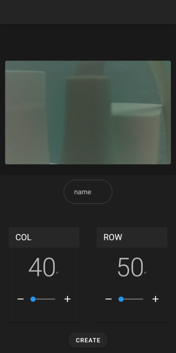
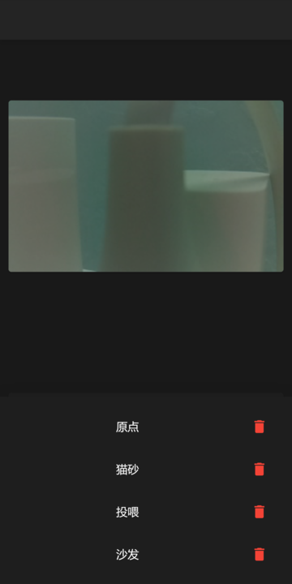
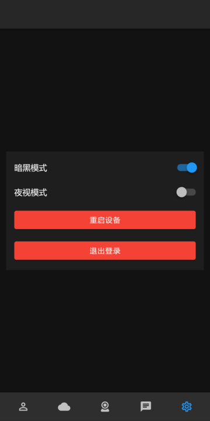


<br>
<br>

## Install

### Project setup
```
cd /to/your/code/path
```
```
npm install
```

<br>
<br>

## Usage

### Compiles and hot-reloads for development
```
npm run serve
```

### Compiles and minifies for production
```
npm run build
```

### Lints and fixes files
```
npm run lint
```

<br>
<br>

## API

### Adding...

